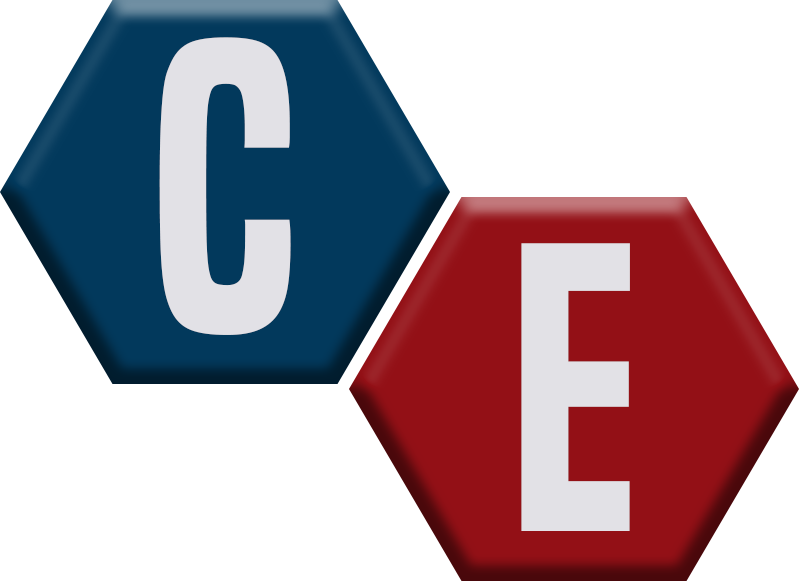

# README

 **Colliding Empires**

[collidingempires.timbachmann.de](http://collidingempires.timbachmann.de)
Gameserver: 185.237.97.233 
Port: 8090

**Spielanleitung**

**1. Das Spielprinzip**

Bei „Colliding Empires“kämpfen 4 Spieler um die Herrschaft einer Karte, die
aus sechseckigen Feldern besteht. Jeder Spieler hat seine eigene Farbe, in der
die sich im Besitz des jeweiligen Spielers befindlichen Felder, sowie dessen
Gebäude und Einheiten eingefärbt werden.
Die Spiel unterteilt sich in Runden. Zu Beginn wird ein zufällig gewählter
Spieler gewählt, der in der ersten Runde das Spiel eröffnet. Während einer
Runde kann der Spieler, der an der Reihe ist, gültige Spielzüge ausführen,
also hat die Wahl mit seinen vorhandenen Recourcen(Münzen) Gebäude zu
bauen, Einheiten zu kaufen oder eben diese zu bewegen um neues Land zu
erobern.

**1.1 Das Ziel**

Das Ziel von Colliding Empires ist die Eroberung der gesamten Spielkarte
oder das Erobern aller gegnerischer Spielfelder. Ist dieses Ziel erreicht wird
das Spiel sofort beendet und der Spieler, der die gesamte Karte erobert hat,
ist der Gewinner.

**Screenshots Menü**

<table>
    <tr>
        <td>
            
        </td>
        <td>
            
        </td>
    </tr>
    <tr>
        <td>
            
        </td>
        <td>
            
        </td>
    </tr>
    <tr>
        <td>
            
        </td>
        <td>
            
        </td>
        <td>
            
        </td>
    </tr>
</table>

**2. Spielablauf**

Ist ein Spieler an der Reihe, so hat er ein Zeitlimit um Aktionen durchzuführen,
in einer Spielrunde gilt folgender Ablauf:
• Der Spieler erhält eine bestimmte Anzahl Münzen
• Der Spieler führt gültige Spielzüge aus
• Der Spieler beendet seinen Zug oder das Zeitlimit läuft ab
Nun ist der nächste Spieler an der Reihe. Dieser Ablauf setzt sich fort bis
das Ziel des Spiels erreicht ist. Das Spiel wird dann sofort beendet und man
gelangt zurück in die Lobby.

**3. Spielregeln**

**3.1 Münzen**

Münzen sind die Recource in „Colliding Empires!“Mit Ihnen kann ein Spieler
Einheiten und Gebäude kaufen. Am Anfang jedes Spielzuges kriegt ein Spieler
Münzen auf sein Konto gutgeschrieben. Eroberte Felder und spezielle Gebäude
generieren Münzen, Einheiten verbrauchen Münzen pro Runde.
Ein Spieler kann nur so viele Einheiten bauen bis die Differenz zwischen
Einkommen und Ausgaben minimal ist.

**3.2 Gebäude und Felder**

Jeder Spieler startet mit 5 Feldern in seiner Farbe und einem Rathaus.

| Art | Kosten | generierte Münzen pro Runde | Sonderfunktion |
| ------ | ------ | ------ | ------ |
| Farm | 12 (+2 pro vorhandener Farm) | 3 | - |
| Rathaus | Nur Initial | - | anliegende Felder Kampfstufe + 1 |
| Turm | 15 | - | anliegende Felder Kampfstufe + 1 |
| Feld | Erobern | 1 | generiert nur sofern kein Baum |

Ein Feld mit einer Farm generiert 4 Münzen pro Runde und nicht 3! Das
Feld wird in diesem Fall also mitgezählt. Genauso erhält der Spieler Münzen
für eigene Felder obwohl sich Gebäude auf diesen befinden.

**3.3 Einheiten**

Einheiten sind dazu da Felder zu erobern und gewachsene Bäume von bereits
eroberten Feldern zu beseitigen, da diese sonst keine Münzen mehr generieren.
Sie verbrauchen jede Runde eine bestimmte Anzahl an Münzen. Jede Einheit
hat eine Bewegungsreichweite von maximal 6 Feldern. Außerdem besitzen
Einheiten eine Kampfstufe, die wichtig wird wenn es um die Eroberung und
Verteidigung von Spielfeldern geht.
Hat man einen einfachen Soldat gekauft, so kann man ihn aufwerten um
seine Kampfstufe zu erhöhen. Einen Soldaten höherer Stufe kann man also
nicht direkt erwerben!

| Level | Kosten | Kosten pro Runde | Kampfstufe |
| ------ | ------ | ------ | ------ |
| 1 | 10 | 1 | 1 |
| 2 | 20 | 5 | 2 |
| 3 | 30 | 10 | 3 |
| 4 | 40 | 20 | 4 |

**3.4 Bewegen und Erobern**
Einheiten können sich nur auf Felder bewegen dessen Kampfstufe niedriger
ist als Ihre Eigene. Ein Feld erhält Kampfstärke durch die Einheit, die sich
auf ihm befindet, so wie durch angrenzende Türme oder Rathäuser(Pro Turm
oder Rathaus +1).
Bewegt sich eine Einheit auf ein Feld mit einem Gegnerischen Gebäude so
wird dieses zerstört und die Einheit besetzt dieses! Eigene Einheiten können
sich nicht auf eigene Felder mit Gebäuden bewegen!
Hat sich eine Einheit auf ein Feld bewegt so gehört dieses Feld ab sofort
automatisch dem Spieler, dem die erobernde Einheit gehört.

**3.5 Bäume**
Im Verlauf des Spiels können auf dem Spielfeld zufällig Bäume wachsen. Diese
verhindern, dass dieses Spielfeld, sofern im eigenen Besitz, Münzen generiert.
Um das Feld wieder freizugeben und den Baum zu entfernen muss sich eine
Einheit auf dieses Feld bewegen. Die Entfernung geschieht also immer wenn
sich eine Einheit auf das Feld bewegt.

**Screenshots Gameplay**

        